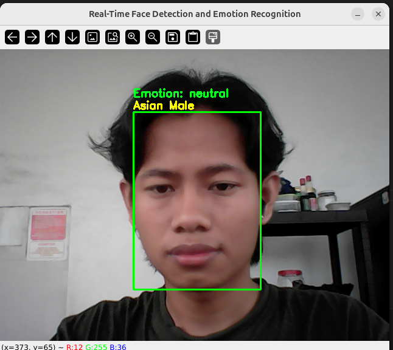

# Real-Time Face Detection and Emotion Recognition

## Overview
This project implements a real-time face detection and emotion recognition system using YOLO for object detection and a Convolutional Neural Network (CNN) for emotion classification. The system detects faces, tracks them, and predicts their emotions in real time using a webcam.

## Features
- **Face Detection**: Utilizes YOLO (You Only Look Once) to detect faces in real-time.
- **Emotion Recognition**: Uses a CNN model to classify emotions into categories such as happy, sad, angry, and more.
- **Template-Based Face Tracking**: Enhances tracking efficiency by using template matching between detection frames.
- **Live Video Processing**: Processes video input from the webcam and overlays detected faces and predicted emotions.

## Requirements
Make sure you have the following dependencies installed before running the program:

```bash
pip install opencv-python numpy ultralytics tensorflow keras
```

## Model Files
Ensure you have the required model files in the working directory:
- `face.pt`: YOLO model for face detection.[Open in Google Colab](https://colab.research.google.com/github/ryasrk/Real-Time-Face-Detection-and-Emotion-Recognition/blob/main/Yolov12_Gender_and_Race.ipynb)
- `emotions.h5`: CNN model for emotion recognition. [Open in Google Colab](https://colab.research.google.com/github/ryasrk/Real-Time-Face-Detection-and-Emotion-Recognition/blob/main/emotion_FER2013_CNN.ipynb)


## How to Run
Run the following command to start the real-time detection:

```bash
python main.py
```

Press `q` to exit the program.

## Explanation
- The system captures frames from the webcam.
- Every 5 frames, YOLO detects faces in the video stream.
- Detected faces are tracked using template matching.
- The CNN model processes detected faces to predict emotions.
- Results are displayed with bounding boxes and emotion labels.

## Emotion Categories
The model predicts the following emotions:
- Angry
- Disgust
- Fear
- Happy
- Neutral
- Sad
- Surprise

## Future Improvements
- Improve tracking using deep learning-based object tracking algorithms.
- Enhance emotion recognition accuracy with a more complex CNN model.
- Optimize YOLO inference speed for real-time performance.

## Output


## License
This project is open-source and available under the MIT License.

